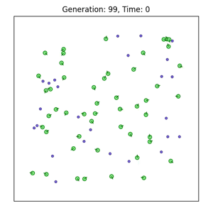
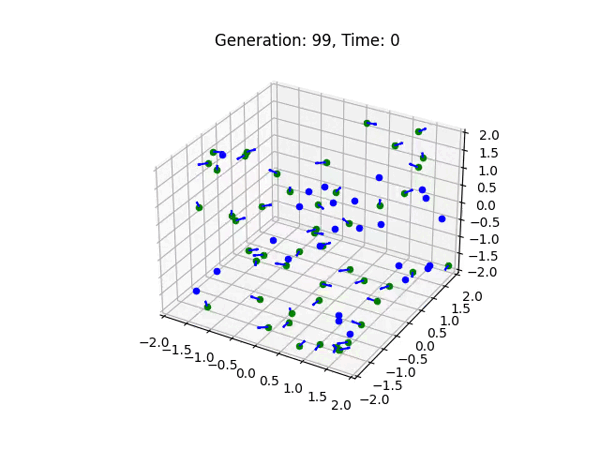

<div id="top"></div>

<br />
<div align="center">
  <a href="https://github.com/wladradchenko/example.genetic.algorithm.wladradchenko.ru">
    
  </a>

  <h3 align="center">Evolving Simple Organisms using a Genetic Algorithm and Simple Neural Network</h3>
</div>

<!-- ABOUT THE PROJECT -->
## О проекте

Узнайте, как развить популяцию простых организмов, каждый из которых содержит простую нейронную сеть, используя генетический алгоритм в 2D и 3D измерениях. Подробнее о том, как работает алгоритм в статье.

<!-- RUN -->
## Запуск

Создать виртуальную среду и активировать:
```
python -m venv venv
source venv/bin/activate
```

Установить зависимости:
```
pip install -r requirements.txt
```

Запуск двумерной симуляции:
```
python 2d/run.py
```

Запуск трехмерной симуляции:
```
python 3d/run.py
```


<!-- EXAMPLE -->
## Пример

<div align="center">
  <table>
  <tr>
    <th>Двумерная симуляция</th>
    <th>Трехмерная симуляция</th>
  </tr>
  <tr align="center">
    <td></td>
    <td></td>
  </tr>
</table>
</div>

<!-- CONTACT -->
## Контакт

Автор: [Wladislav Radchenko](https://github.com/wladradchenko/)

Почта: [i@wladradchenko.ru](i@wladradchenko.ru)


<p align="right">(<a href="#top">вернуться наверх</a>)</p>
