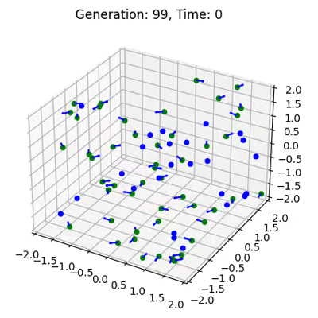

<div id="top"></div>

<br />
<div align="center">
  <a href="https://github.com/wladradchenko/example.genetic.algorithm.wladradchenko.ru">
    
  </a>

  <h3 align="center">Evolving Simple Organisms using a Genetic Algorithm and Simple Neural Network</h3>
</div>

<!-- ABOUT THE PROJECT -->
## About

Learn how to evolve a population of simple organisms each containing a simple neural network using a genetic algorithm in 2d and 3d dimensions. 

<!-- RUN -->
## Run

Create enviroment:
```
python -m venv venv
source venv/bin/activate
```

Install requirements:
```
pip install -r requirements.txt
```

Run 2d simulation:
```
python 2d/run.py
```

Run 3d simulation:
```
python 3d/run.py
```


<!-- EXAMPLE -->
## Example

<div align="center">
  <table>
  <tr>
    <th>2d simulation</th>
    <th>3d simulation</th>
  </tr>
  <tr align="center">
    <td></td>
    <td></td>
  </tr>
</table>
</div>

<!-- CONTACT -->
## Contact

Owner: [Wladislav Radchenko](https://github.com/wladradchenko/)

Email: [i@wladradchenko.ru](i@wladradchenko.ru)


<p align="right">(<a href="#top">Up</a>)</p>
